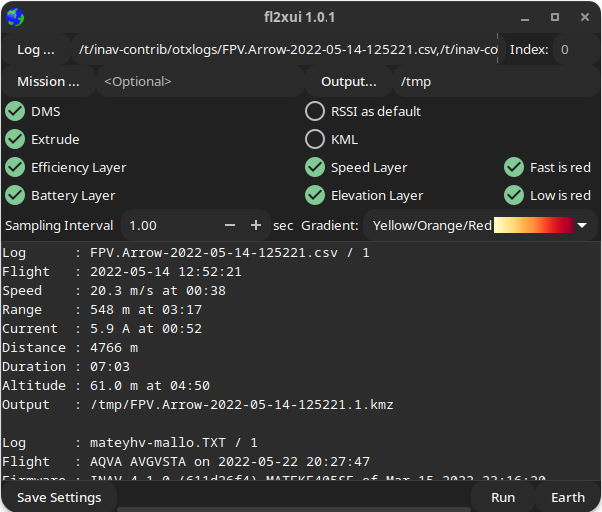
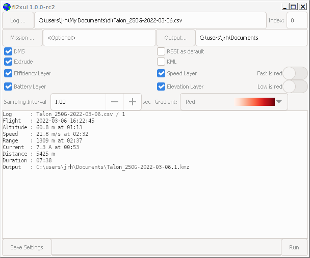

## fl2xui

fl2xui is a cross-platform  GUI for the [flightlog2kml](https://github.com/stronnag/bbl2kml) tool.





* Multiple logs (BBL, OTX)
* Summary information

## User Guide

The user guide is [online](https://stronnag.github.io/fl2xui/). The following sections are a summary.

## OS Specific features and limitations

### Linux, FreeBSD

* Drag and drop of (multiple) logs and mission files from the file manager.
* Multiple selection of logs from file chooser

### Windows

* Multiple selection of logs from file chooser
* No drag and drop

## Installation

### Linux, FreeBSD

* Common GTK packages
* Easily built from source
    ```
	# Once (setup)
	meson build --buildtype=release --strip --prefix=~/.local
	# Build and install to ~/.local/bin (add to PATH if necessary)
	meson install -C build
   ```
* Debian package `*.deb` for Debian / Ubuntu and derivatives in release area.
* Output by default to current working directory.

### Windows

* Win64 Zip file (release area)  provided with shortcut.
* Multiple files may be selected from the file chooser.
* Output by default to the user's "Documents" (`C:\Users\USERNAME\Documents`) directory.
* Can be built from source using Msys2.
* Recommended that `blackbox_decode` and `flightlog2kml` are in the `fl2xui\bin` directory (as in the release archive).

### MacOS

* Use Homebrew:
    ```
    	#install requirements:
    	brew install meson vala gtk+3 json-glib
	# Once (setup)
	meson build --buildtype=release --strip --prefix=~/.local
	# Build and install to ~/.local/bin (add to PATH if necessary)
	sudo meson install -C build
   ```   ... 
