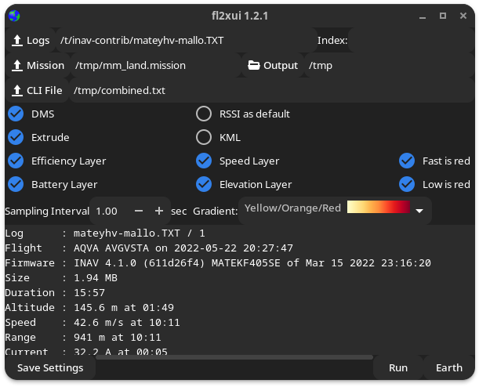

## fl2xui

fl2xui is a cross-platform  GUI for the [flightlog2kml](https://github.com/stronnag/bbl2kml), a tool to generate beautiful colour coded, annotated, animated KML / KMZ from INAV blackbox and other (OTX, ETX, Bullet GCSS) flight logs.

* Multiple logs (BBL, OTX)
* Summary information

<figure>
  
  <figcaption>example flightlog2kml Efficiency Plot</figcaption>
</figure>

## User Guide

The user guide is [online](https://stronnag.github.io/fl2xui/).

## Dependencies

fl2xui requires components from the following open source packages:

* [flight2kml](https://github.com/stronnag/bbl2kml/)
* [INAV's blackbox_decode](https://github.com/iNavFlight/blackbox-tools)

## Installation

Binary packages in the [release area](https://github.com/stronnag/fl2xui/releases) for Debian based Linux distros.

Easily built from source for other Linux, FreeBSD and Windows. Build instructions in the [user guide](https://stronnag.github.io/fl2xui/).
