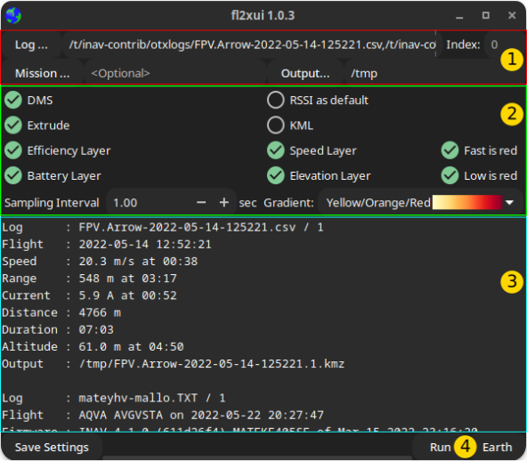

title: fl2xui
summary: User Guide
authors:
    - Jonathan Hudson

# fl2xui

## Overview

{{ fl2xui }} is a cross-platform  GUI for the {{ bbl2kml }} tool that converts ({{ inav }}) flight logs to beautiful, annotated KML or KMZ files for visualisation in Google Earth.

{{ fl2xui }} provides a consistent user interface across Linux, FreeBSD, MacOS and Windows.

### Linux (dark theme)

{: width="40%" }

### MacOS

{: width="40%" }

### Windows

{: width="40%" }

### Features

* Multiple logs (Blackbox, OTX/ETX CSV)
* Summary information
* Easy access to common visualisation options.


## User Interface

{: width="60%" }

### File / index selection area (1)

* **Log...** : Opens a file chooser to select log files. Multiple files may be selected. The files may be a combination of Blackbox logs or OpenTX / EdgeTX CSV logs.
* **Output...** : Opens a file chooser to select the output directory. The defaults (no selection) are:
    * Linux, FreeBSD, MacOS : Current (working) directory, typically `$HOME` when launched from a desktop environment.
	* Windows : "Documents" (e.g. `C:\Users\USERNAME\Documents`).
 * **Mission...** : Optional mission file (single selection). MW XML format (e.g. from {{ mwp }} or {{ inav }} configurator.
 * **Index** : If 0 (default), processes all logs in (each) file; if non zero, processes a single log at the specified index.

### Visualisation Options (2)

!!! info "Drag and drop"

    On Linux / FreeBSD, you can also drag and drop logs and mission files into this area, at least with the Gnome desktop environment.

* **DMS** : Display positions as degrees / minutes / seconds (`DD:MM:SS.sss`) vice decimal degress (`DD.dddddd`).
* **Extrude** : Extrude flight points the ground.
* **Efficiency Layer** : Include an efficiency layer in the output.
* **RSSI as default** : Set the RSSI layer as the default (vice Flight Mode).
* **KML** : Generate uncompressed KML (vice compressed KMZ).
* **Gradient** : Select the colour gradient for RSSI / Efficiency layer)
    * **Red** - shades of red
    * **Green / Red** - Green (best) to red (worst)
    * **Yellow / Orange / Red** - Yellow (best) to red (worst) via orange

### Output Area (3)

* Output Area : Scrolled window showing process or error messages.

### Progress bar and Run button (4)

* Run button is enabled when log files have been selected
* An oscillating progress bar is displayed when a conversion is in process (after clicking "Run").

## Defaults

The defaults for run time options are taken from the {{ bbl2kml }} configuration file:
* **POSIX OS** : ~/.config/fl2x/config.json
* **Windows** : %APPDATA%\fl2x\config.json

See also [flight2kml wiki example](https://github.com/stronnag/bbl2kml/wiki/Sample-Config-file).

## Installation

### Linux, FreeBSD

* Common GTK packages
* Debian package `*.deb` for Debian / Ubuntu and derivatives in [fl2xui release area](https://github.com/stronnag/fl2xui/releases).
* Easily built from source

    ```
    # Once (setup)
    meson build --buildtype=release --strip --prefix=~/.local
    # Build and install to ~/.local/bin (add to PATH if necessary)
	# or specify some other PATH element (/usr/bin, /usr/local/bin, ~/bin)
    meson install -C build
    ```

### Windows

* Win64 Installer file in the [fl2xui release area](https://github.com/stronnag/fl2xui/releases),  creates a desktop shortcut launcher.
* Win64 Zip file in the [fl2xui release area](https://github.com/stronnag/fl2xui/releases),  provided with shortcut launcher.
* Can be built from source using Msys2 (as Linux).
* It is recommended that `blackbox_decode` and `flightlog2kml` are in the `fl2xui\bin` directory (as in the release archive).

### MacOS

* Homebrew or similar environment is required to build from source (as Linux).

## Author and Licence

(c) 2020 Jonathan Hudson

GPL v2 or later.
