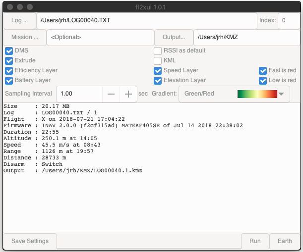
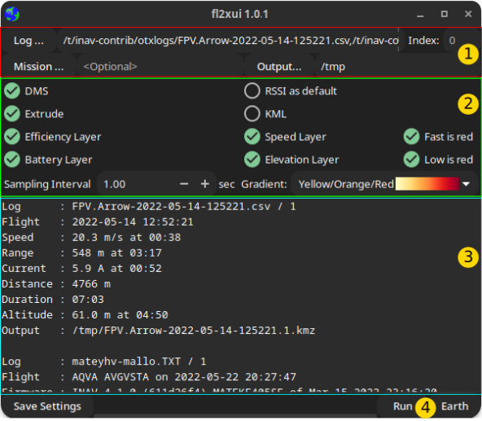

title: fl2xui
summary: User Guide
authors:
    - Jonathan Hudson

# fl2xui

## Overview

{{ fl2xui }} is a cross-platform  GUI for the {{ bbl2kml }} tool that converts ({{ inav }}) flight logs to beautiful, annotated KML or KMZ files for visualisation in Google Earth.

{{ fl2xui }} provides a consistent user interface across Linux, FreeBSD, MacOS and Windows.

### Linux /FreeBSD (dark theme)

{: width="40%" }

### MacOS

{: width="40%" }

### Windows

{: width="40%" }

### Features

* Multiple logs (Blackbox, OTX/ETX CSV, BulletGCCS)
* Summary information
* Easy access to common visualisation options.
* Save current settings as default

## User Interface

{: width="40%" }

### File / index selection area (1)

* **Log...** : Opens a file chooser to select log files. Multiple files may be selected. The files may be a combination of Blackbox logs, OpenTX / EdgeTX CSV or BulletGCSS logs.
* **Output...** : Opens a file chooser to select the output directory. The defaults (no selection) are:
    * Linux, FreeBSD, MacOS : Current (working) directory, typically `$HOME` when launched from a desktop environment.
	* Windows : "Documents" (e.g. `C:\Users\USERNAME\Documents`).
 * **Mission...** : Optional mission file (single selection). MW XML format (e.g. from {{ mwp }} or {{ inav }} configurator).
 * **Index** : If 0 (default), processes all logs in (each) file; if non zero, processes a single log at the specified index.

### Visualisation Options (2)

* **DMS** : Display positions as degrees / minutes / seconds (`DD:MM:SS.sss`) vice decimal degrees (`DD.dddddd`).
* **Extrude** : Extrude flight points the ground.
* **RSSI as default** : Set the RSSI layer as the default (vice Flight Mode).
* **KML** : Generate uncompressed KML (vice compressed KMZ).
* **Efficiency Layer** : Include an efficiency layer in the output.
* **Battery Layer** : Include a battery (VBAT) layer in the output.
* **Speed Layer** : Include a speed layer in the output.
    * **Fast is red** : Invert the speed colour gradient, so the fastest speed is red
* **Elevation Layer** : Include an elevation layer in the output.
    * **Low is red** : Invert the elevation colour gradient, so the lowest elevation is red
* **Gradient** : Select the colour gradient for RSSI / Efficiency layer)
    * **Red** - shades of red
    * **Green / Red** - Green (best) to red (worst)
    * **Yellow / Orange / Red** - Yellow (best) to red (worst) via orange

### Output Area (3)

* Output Area : Scrolled window showing process or error messages. You can also drag and drop log and mission files into this area.

### Progress bar / Save Settings / Run / Earth buttons (4)

* Current settings may be saved as defaults
* "Run" button is enabled when log files have been selected
* "Earth" button is enabled when a KMZ/L is available and Google Earth was not launched by fl2xui. This button launches Google Earth, with the last generated KML/Zs (on MacOS it appears not possible to load the KML/Z files). This function may also be invoked with CTRL-L.
* An oscillating progress bar is displayed when a conversion is in process (after clicking "Run").

## Defaults

The defaults for run time options are taken from the {{ bbl2kml }} configuration file:

* **All POSIX OS** : ~/.config/fl2x/config.json
* **Windows** : %LOCALAPPDATA%\fl2x\config.json

See also [flight2kml wiki example](https://github.com/stronnag/bbl2kml/wiki/Sample-Config-file) and [Earth definition](#google-earth-launcher) if Google Earth is not automatically detected for launch.

## Dependencies

{{ fl2xui }} depends upon the following open source packages:

* [flight2kml](https://github.com/stronnag/bbl2kml/)
* [INAV's blackbox_decode](https://github.com/iNavFlight/blackbox-tools)

Unless you're using the Windows installer, you need to install [flight2kml](https://github.com/stronnag/bbl2kml/) and [INAV's blackbox_decode](https://github.com/iNavFlight/blackbox-tools) from their respective repositories.

## Installation

Debian (and derivatives) and Windows have binary installers in the  [fl2xui release area](https://github.com/stronnag/fl2xui/releases).

### UI Component

* The `master` branch is based on gtk4. There is a `legacy` branch based on gtk3, which is no longer actively maintained. The `legacy` branch is intended for older Linux distros that do not offer gtk4.
* The `master` branch requires the `blueprint-compiler`, if your distro cannot provide this, a local copy will be downloaded when the build is first configured.

### Linux, FreeBSD

* Debian package `*.deb` for Debian / Ubuntu and derivatives in [fl2xui release area](https://github.com/stronnag/fl2xui/releases).
* Easily built from source

        Common GTK development packages for gtk4 vala meson ninja json-glib
        # Once (setup)
    	meson build --buildtype=release --strip --prefix=~/.local
		# Build and install to ~/.local/bin (add to PATH if necessary)
    	# or specify some other PATH element (/usr/bin, /usr/local/bin, ~/bin)
    	meson install -C build

### Windows

* Win64 Installer file in the [fl2xui release area](https://github.com/stronnag/fl2xui/releases),  creates a desktop shortcut launcher.
* Can be built from source using Msys2.

    	pacman -Syu
    	pacman -S gtk4 vala meson ninja json-glib
		# export the msys2 expression of /usr/share, such as
		export XDG_DATA_DIRS=$XDG_DATA_DIRS:/mingw64/share
    	# now follow Linux instructions ...

* It is recommended that `blackbox_decode` and `flightlog2kml` are in the `fl2xui\bin` directory (as in the release archive).

#### Look and Feel

From {{ fl2xui}} 0.0.5, the default theme is set to emulate the Windows 10 look and feel. This may be changed by copying the distributed  `fl2xui\etc\gtk-4.0\settings.ini` (or `fl2xui\etc\gtk-3.0\settings.ini` for gtk3) to `%LOCALAPPDATA%\gtk-4.0\settings.ini` (`%LOCALAPPDATA%\gtk-3.0\settings.ini`) and editing some settings as required:

* `gtk-theme-name` : sets the theme name
    * `Windows10` : Windows 10 theme emulation
    * `Adwaita` : Default GTK theme
    * `win32` : Ugly Windows 7 (more like Windows 95?) theme
* `gtk-application-prefer-dark-theme` : set a dark theme
    * `0` light theme
	* `1` dark theme

The Window header bar (may be drawn by either the Windows window manager or the application).
This is controlled by the environment variable `GTK_CSD`, (0=Native, 1=GTK). This may be set as a user environment variable from the Windows Control Panel.

### MacOS

* Use Homebrew:

    	# install requirements:
    	brew install meson vala gtk4 json-glib
    	# Once (setup)
    	meson build --buildtype=release --strip --prefix=~/.local
    	# Build and install to ~/.local/bin (add to PATH if necessary)
    	meson install -C build

* If there are missing icons (specifically the +/- for time interval widget), it may be necessary to `brew install adwaita-icon-theme`.

## Google Earth launcher

fl2xui Attempts to detect the presence of Google Earth. Only if this fails is it necessary to add the name of the Google Earth executable in the configuration file:

* On (non-macOS) POSIX (Linux, FreeBSD) platforms, where Google Earth is customarily on PATH, just the executable name is required, for example:

        "ge-name" : "google-earth-pro"

* On Windows, the full path is required, for example (note back-slashes have to be escaped):

        "ge-name" : "C:\\Program Files\\Google\\Google Earth Pro\\client\\googleearth.exe"

* On macOS,  Google Earth is not auto-detected, so needs an entry like:

        "ge-name" :  "/Applications/Google Earth Pro.app/Contents/MacOS/Google Earth"

    It is also unlikely that macOS will actually load your files into Earth. Advice on how to resolve this would be appreciated.

## Author and Licence

(c) Jonathan Hudson

GPL v2 or later.
